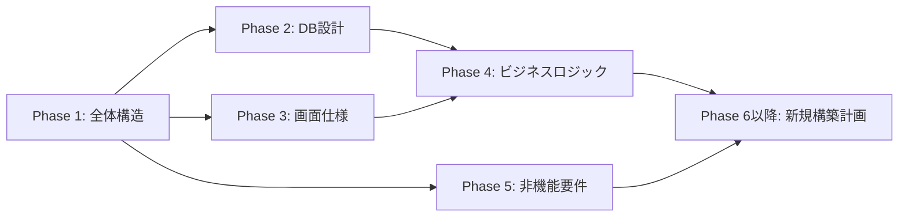

# AGENTS.md — Modenize プロジェクト計画書

## プロジェクト概要

- **現行**: VB.NET (.NET Framework 4.8) クライアントサーバー型デスクトップアプリ
- **目標**: C# / .NET 10 Webアプリケーションへのモダナイズ
- **課題**: 既存アプリに設計書・仕様書が存在しない
- **方針**: Codex (GPT-5.2-Codex) を使いソースコードからリバースエンジニアリングでドキュメントを生成

## 前提条件

- Codexは既存VB.NETソースコードのリポジトリに対して実行する（このリポジトリではない）
- Codexにはプロンプトをコピペで渡す
- 各Phaseの成果物は、後続Phaseのプロンプトに文脈として貼り付けて引き継ぐ

## 実行計画

| Phase | 目的 | 出力物 |
|-------|------|--------|
| 1 | 全体構造の把握 | ソリューション構成図、アーキテクチャ概要、技術スタック |
| 2 | データベース設計の抽出 | テーブル一覧、ER図、CRUD表、ストアド一覧 |
| 3 | 画面一覧・画面仕様の抽出 | 画面一覧、遷移図、個別画面仕様書 |
| 4 | ビジネスロジックの抽出 | 機能一覧、個別機能仕様、共通処理一覧 |
| 5 | 非機能要件の抽出 | 認証・ログ・帳票・通信・排他制御 |

## 実行順序と依存関係

- **Phase 1** を最初に実行（他の全Phaseの前提）
- **Phase 2, 3, 5** は Phase 1 完了後に並行実行可能
- **Phase 4** は Phase 2, 3 の結果を参照するため最後に実行

## Phase 6以降（後日追記予定）

Phase 1〜5 のドキュメントが揃った後、以下を計画する:

- Phase 6: 新アーキテクチャ設計（C# / .NET 10 / Blazor or ASP.NET Core MVC）
- Phase 7: データベースマイグレーション計画
- Phase 8: 機能単位の移行実装
- Phase 9: テスト計画・実行
- Phase 10: デプロイ・移行計画

## 関連ドキュメント

- [実行手順書](./docs/procedure.md) — 人間が読む手順書・コンテキスト管理戦略
- [Codex用AGENTS.md](./codex/AGENTS.md) — 既存VB.NETリポジトリに配置するCodex指示書
- [Codex用tasks.md](./codex/tasks.md) — 既存VB.NETリポジトリに配置するタスク管理表
