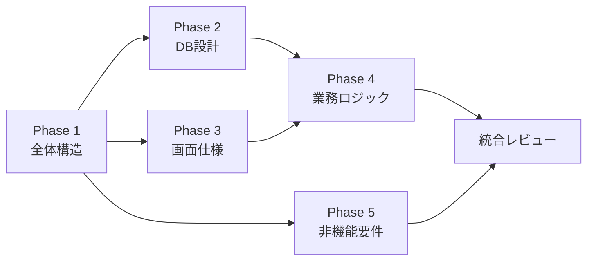

# Codexによるリバースエンジニアリング 実行手順書

## このドキュメントについて

既存VB.NETアプリのソースコードから、Codex (GPT-5.2-Codex) を使って設計ドキュメントを生成するための手順書です。

- 進捗管理は既存VB.NETリポジトリ側の `tasks.md` でCodexが自動管理します
- Codexに `次` `完了` `状況` と伝えるだけで進められます（[codex/AGENTS.md](../codex/AGENTS.md) 参照）
- このファイルは人間が読む補足手順書です（コンテキスト管理戦略・レビューチェックリスト等）

---

## 事前準備

### 必要なもの

| # | 項目 | 確認欄 |
|---|------|--------|
| 1 | 既存VB.NETアプリのソースコード一式がGitHubリポジトリにpush済みであること | [ ] |
| 2 | Codex (GPT-5.2-Codex) にそのリポジトリへのアクセス権があること | [ ] |
| 3 | 成果物を保存するフォルダまたはリポジトリを用意すること | [ ] |

### Codexの使い方（基本）

- Codexは既存VB.NETリポジトリ上で動かす
- 各Phaseのプロンプトを**コピペ**してCodexに渡す
- プロンプトは「共通ヘッダー」+「Phase別の指示」の2つを結合して使う
- 出力結果はMarkdownファイルとして保存する

### Step 0. リポジトリの規模を確認する

**Codexに指示を出す前に**、まず以下のプロンプトでリポジトリの規模を把握してください。

```
このリポジトリの規模を調査し、以下をテーブル形式で出力してください。

1. プロジェクト別ファイル数
   （プロジェクト名 / .vbファイル数 / .designer.vbファイル数 / その他ファイル数）
2. 合計ファイル数・合計行数（概算）
3. プロジェクトを「規模」でランク付け（Large / Medium / Small）
```

この結果を元に、以降の分割戦略を決めます。

---

## コンテキスト管理戦略

ファイル・プロジェクト数が多い場合、Codexのコンテキスト上限に収まらない可能性があります。
以下の戦略で対処してください。

### 原則: 「全体→個別」の2段階で進める

```
Round 1: 全体を薄く広くスキャン → 一覧・概要レベルの成果物
Round 2: 一覧を元にプロジェクト単位/画面単位で深掘り
```

### 戦略1: プロジェクト単位で分割実行する

リポジトリ全体を一度に解析させず、**プロジェクトごとに指示を分ける**。

プロンプトに以下を追加:

```
## 解析スコープ
このタスクでは以下のプロジェクトのみを対象としてください。
他のプロジェクトは無視してください。

対象プロジェクト: {プロジェクト名}
対象パス: src/{プロジェクト名}/
```

### 戦略2: Designer.vb を除外する

WinFormsの `.Designer.vb` ファイルは自動生成コードであり、コンテキストを大量に消費します。
コントロール一覧だけ必要な場合を除き、除外指示を入れてください。

プロンプトに以下を追加:

```
## 除外ファイル
- *.Designer.vb ファイルは解析対象から除外してください
  （ただしコントロール名の一覧が必要な場合のみ参照可）
- *.resx ファイルも除外してください
- bin/ obj/ packages/ フォルダは除外してください
```

### 戦略3: Phase 3-2, 4-2 はバッチ実行する

個別画面仕様書や個別機能仕様書を作る際、**1回のプロンプトに詰め込む画面数を制限**する。

| リポジトリ規模 | 1回あたりの目安 |
|---|---|
| 小（〜20画面） | 全画面を1回で |
| 中（20〜50画面） | 5〜10画面ずつ |
| 大（50画面〜） | 3〜5画面ずつ、またはプロジェクト単位 |

### 戦略4: 前フェーズ成果の貼り付けを絞る

Phase間で引き継ぐ情報は**要約だけ**にする。全文を貼ると後続プロンプトのコンテキストを圧迫します。

```
## 前フェーズの成果（要約）
- プロジェクト構成: UI層(ProjectA), BL層(ProjectB), DAL層(ProjectC), 共通(ProjectD)
- DB: SQL Server、テーブル数 約40、ストアド 約15
- 画面数: Form 35個、UserControl 12個
- 主要画面: frmLogin → frmMenu → frmOrder / frmCustomer / frmReport
```

> **全文が必要な場合**: CRUD表やテーブル一覧など、具体的な名前の突合が必要なときだけ全文を貼る

### 戦略5: 段階的に深掘りする

1回目で概要を出させ、2回目で詳細を掘るパターン。

**1回目（広く浅く）:**
```
このプロジェクトの全Formクラスについて、
クラス名・タイトル・推定機能を1行ずつ一覧にしてください。
詳細な解析は不要です。
```

**2回目（狭く深く）:**
```
以下のFormクラスについて、詳細な画面仕様書を作成してください。
対象: frmOrder, frmOrderDetail, frmOrderSearch
```

### 分割実行の管理表

以下のような表を作り、進捗を管理してください。

| Phase | 対象 | ステータス | 成果物 | 備考 |
|-------|------|-----------|--------|------|
| 1 | 全体 | 未着手 | | |
| 2 | 全体 | 未着手 | | |
| 3-1 | 全体（一覧） | 未着手 | | |
| 3-2 | ProjectA の画面群 | 未着手 | | |
| 3-2 | ProjectB の画面群 | 未着手 | | |
| ... | ... | ... | | |

---

## 全体の流れ

```
Step 1. 共通ヘッダーを手元にコピーしておく
Step 2. Phase 1 を実行 → 結果をレビュー・保存
Step 3. Phase 2, 3, 5 を並行実行 → 結果をレビュー・保存
Step 4. Phase 4 を実行 → 結果をレビュー・保存
Step 5. 全成果物を統合レビュー
```



> **ポイント**: Phase 2, 3, 5 は互いに依存しないため、Codexの別セッションで同時に走らせてOKです。Phase 4 だけは Phase 2, 3 の結果が必要なので最後に回します。

---

## Step 1. 共通ヘッダーを準備する

以下を手元にコピーしてください。**すべてのPhaseでプロンプトの先頭に貼り付けます。**

```
あなたはシニアソフトウェアアーキテクトです。
このリポジトリはVB.NET (.NET Framework 4.8) のクライアントサーバー型デスクトップアプリです。
ソースコードを解析し、設計ドキュメントを作成してください。

## 出力ルール
- 日本語で記述すること
- Markdown形式で出力すること
- 図表は Mermaid記法 を使用すること
- ソースコードから読み取れる「事実」と「推測」を区別すること
  - 事実: そのまま記述
  - 推測: 【推測】を先頭に付与
- 不明点には【要確認】を付けること
- マジックナンバーやハードコードされた値にも【要確認】を付けること
- 各ドキュメントの先頭に「対象範囲」と「解析対象ファイル数」を記載すること
```

---

## Step 2. Phase 1 — 全体構造の把握

**目的**: アプリの全体像を掴む。以降の全Phaseの土台になる。

### やること

1. 共通ヘッダー + 下記プロンプトを結合してCodexに渡す
2. 出力結果をレビューする
3. 結果を保存する（後のPhaseで参照用に使う）

### Codexに渡すプロンプト

```
このリポジトリのソースコード全体を調査し、以下のドキュメントを作成してください。

### 1. ソリューション構成図
- .slnファイルに含まれるプロジェクト一覧をテーブルで出力
  （プロジェクト名 / 種別 / ターゲットFW / 出力タイプ）
- プロジェクト間の参照関係をMermaidのグラフで出力

### 2. アーキテクチャ概要
- レイヤー構成を特定（UI層 / ビジネスロジック層 / データアクセス層 / 共通層）
- 各レイヤーに属するプロジェクト・名前空間のマッピングテーブル
- アーキテクチャ図をMermaidで出力

### 3. 技術スタック一覧
- .NET Frameworkバージョン
- 使用NuGetパッケージ一覧
  （packages.config または PackageReference から。名前 / バージョン / 用途推定）
- 外部ライブラリ・COM参照一覧
- 使用フレームワーク・ミドルウェア（WCF / WinForms / Crystal Reports等）

### 4. エントリーポイントと起動フロー
- Main関数またはアプリケーション起動処理の場所
- 起動時の初期化処理を順に記述
- 最初に表示される画面とログインフローの有無
- 起動フローをMermaidのシーケンス図で出力
```

### レビューチェックリスト

- [ ] プロジェクト一覧は .sln の内容と一致しているか
- [ ] 参照関係の図に漏れがないか（.vbproj の Reference を目視確認）
- [ ] NuGetパッケージは packages.config の内容と一致しているか
- [ ] 起動フォームは実際にアプリを起動した画面と一致するか

---

## Step 3-A. Phase 2 — データベース設計の抽出

**目的**: どんなテーブルがあり、どの画面がどのテーブルを使っているかを把握する。

### Codexに渡すプロンプト

**共通ヘッダー** + **Phase 1の成果（下記形式で貼り付け）** + **下記プロンプト** を結合する。

```
## 前フェーズの成果（参考情報）
以下は Phase 1 で作成したソリューション構成とアーキテクチャ概要です。
この情報を踏まえて解析してください。
---
（★ Phase 1 の出力結果をここに貼り付ける ★）
---
```

```
このリポジトリのデータアクセス層を中心にソースコード全体を解析し、
以下のドキュメントを作成してください。

### 1. データベース接続情報
- 接続文字列の定義場所と内容（パスワード等は「****」でマスク）
- DB種別（SQL Server / Oracle / Access 等）
- 接続管理方式（接続プーリング、都度Open/Close、共通接続クラスの有無）

### 2. テーブル一覧
- SQL文やストアドプロシージャ呼び出しからテーブル名を抽出
- テーブルごとにテーブル形式で出力:
  テーブル名 / 推定用途 / 参照ソースファイル / 使用カラム名

### 3. ER図
- JOIN句、WHERE句の結合条件から推測したリレーション
- Mermaid erDiagram形式で出力

### 4. CRUD表
- Form名 × テーブル名 のマトリクス
- 各セルにC/R/U/Dを記入（Markdownテーブル）

### 5. ストアドプロシージャ一覧
- コードから呼び出されるストアドプロシージャ名
- 呼び出し元（Form名 / クラス名 / メソッド名）
- パラメータ（判明する範囲で）
```

### レビューチェックリスト

- [ ] 接続文字列にパスワードが平文で残っていないか
- [ ] 主要テーブルが漏れていないか（実DBのテーブル一覧と突合）
- [ ] CRUD表の「空欄」が本当に使っていないか（検索漏れの可能性）

---

## Step 3-B. Phase 3 — 画面一覧・画面仕様の抽出

**目的**: 全画面の一覧と遷移を把握し、主要画面の仕様書を作る。

### Phase 3-1: 画面一覧と遷移図

**共通ヘッダー** + **Phase 1の成果** + 下記を渡す。

```
このリポジトリのすべてのFormクラスとUserControlクラスを調査し、
以下のドキュメントを作成してください。

### 1. 画面一覧
テーブル形式で出力:
- フォームクラス名
- Textプロパティ（タイトル）
- 推定機能概要
- 所属プロジェクト
- 主要コントロール数（ボタン、テキストボックス等の合計）

### 2. 画面遷移図
- 各Formから他のFormをShow / ShowDialogしている箇所を特定
- 遷移時にパラメータを渡している場合はその内容も記載
- Mermaid stateDiagram形式で出力
- メニュー画面がある場合はメニュー構造も記載
```

### Phase 3-2: 個別画面仕様書

Phase 3-1 の画面一覧が出たら、重要な画面から順に以下を実行する。
`{フォーム名}` を実際のクラス名に差し替えてください。

```
以下のFormクラス「{フォーム名}」の画面仕様書を作成してください。

### 出力項目
1. 画面名・タイトル・概要
2. 配置コントロール一覧
   （テーブル: コントロール名 / 種別 / 表示テキスト / 主要プロパティ / 備考）
3. 初期表示処理（Form_Load等の処理内容）
4. イベントハンドラ一覧
   （テーブル: コントロール名 / イベント / 処理概要）
5. 各イベントハンドラの詳細処理フロー
6. バリデーションルール一覧
   （テーブル: 対象項目 / ルール / エラーメッセージ）
7. 使用テーブル・ストアドプロシージャ
8. 呼び出し元画面・遷移先画面
9. エラーメッセージ一覧（MsgBox / MessageBox.Showから抽出）
```

> **画面数が多い場合の進め方**:
> 1. まず全画面一覧を出す（3-1）
> 2. ログイン画面・メインメニュー・最も使う業務画面を優先して仕様書を作る
> 3. 残りは業務領域ごとにまとめて実行する
>    例: 「以下のFormクラス群の画面仕様書をまとめて作成してください: FormA, FormB, FormC」

### レビューチェックリスト

- [ ] 画面一覧と実際のアプリの画面数が一致するか
- [ ] 画面遷移図の漏れがないか（実アプリを操作して確認）
- [ ] バリデーションルールが実際の動作と一致するか

---

## Step 3-C. Phase 5 — 非機能要件の抽出

**目的**: 認証・ログ・帳票・通信など、機能横断的な仕組みを把握する。

### Codexに渡すプロンプト

**共通ヘッダー** + **Phase 1の成果** + 下記を渡す。

```
このリポジトリの非機能面を調査し、以下の各ドキュメントを作成してください。

### 1. 認証・認可
- ログイン処理の実装箇所と方式（DB認証/Windows認証/独自等）
- ユーザーテーブル・権限テーブルの構造（推定）
- 画面・機能レベルのアクセス制御（メニュー非表示、ボタン無効化等）

### 2. ログ出力
- ログ出力ライブラリ（log4net / NLog / 独自実装 等）
- ログ出力先（ファイル / DB / イベントログ）
- ログレベルの使い分け

### 3. 設定管理
- app.config / 独自設定ファイルの構成項目一覧
- 設定値テーブル（キー / 値の例 / 用途）

### 4. 帳票・印刷
- 帳票出力機能の有無
- 使用ライブラリ（Crystal Reports / RDLC / GrapeCity等）
- 帳票一覧（テーブル: 帳票名 / 出力形式 / 出力契機 / 関連画面）

### 5. ファイルI/O
- CSV / Excel / PDF等のインポート・エクスポート機能一覧
- 使用ライブラリ（ClosedXML / EPPlus等）

### 6. 通信方式
- クライアント−サーバー間の通信方式
  （WCF / .NET Remoting / Web API / DB直接接続等）
- 外部サービス連携の有無

### 7. 排他制御・トランザクション管理
- 楽観的ロック / 悲観的ロックの実装箇所
- TransactionScope / SqlTransactionの使用箇所
```

### レビューチェックリスト

- [ ] ログイン方式は実際の動作と一致するか
- [ ] app.configの設定項目に漏れがないか（実ファイルと突合）
- [ ] 帳票が実際の印刷物と一致するか

---

## Step 4. Phase 4 — ビジネスロジックの抽出

**目的**: 業務ロジックの全体像を把握し、主要機能の仕様書を作る。

> **前提**: Phase 2（DB設計）と Phase 3（画面仕様）の結果が必要です。

### Phase 4-1: 機能一覧と共通処理

**共通ヘッダー** + **Phase 1, 2, 3 の成果** + 下記を渡す。

```
## 前フェーズの成果（参考情報）
以下はこれまでに作成した設計ドキュメントです。この情報を踏まえて解析してください。
---
（★ Phase 1 のアーキテクチャ概要を貼り付け ★）
（★ Phase 2 のテーブル一覧・CRUD表を貼り付け ★）
（★ Phase 3 の画面一覧・遷移図を貼り付け ★）
---
```

```
このリポジトリのビジネスロジック層
（UI層のイベントハンドラ内ロジックを含む）を解析し、
以下のドキュメントを作成してください。

### 1. 業務機能一覧
テーブル形式で出力:
- 機能ID（連番）
- 機能名（推定）
- 概要
- 関連画面（Form名）
- 関連テーブル
- 重要度（High/Medium/Low — コード量・参照頻度から推定）

### 2. 共通処理・ユーティリティ一覧
Module、共通クラス、Helperクラスを解析:
- クラス/モジュール名
- メソッド一覧（メソッド名 / 引数 / 戻り値 / 処理概要）
- 呼び出し元の数（利用頻度の目安）
```

### Phase 4-2: 個別機能仕様書

Phase 4-1 の機能一覧から、重要度 High のものから順に実行する。
`{機能名}` `{関連フォーム名}` `{関連クラス名}` を差し替えてください。

```
以下の業務機能「{機能名}」の仕様書を作成してください。
関連するForm: {関連フォーム名}
関連するクラス/モジュール: {関連クラス名}

### 出力項目
1. 機能名と概要
2. 入力（画面入力項目 / パラメータ / 前提条件）
3. 処理フロー（Mermaid flowchart形式。条件分岐・ループを含む）
4. ビジネスルール・計算式（金額計算、日付計算、ステータス遷移等）
5. 出力（DB更新内容 / 画面表示 / ファイル出力 / 印刷）
6. エラーハンドリング（Try-Catch、エラー時の挙動）
7. 他機能との依存関係
```

### レビューチェックリスト

- [ ] 機能一覧に業務上重要な機能が漏れていないか（業務担当者に確認）
- [ ] 計算式・ビジネスルールが実際の業務ルールと一致するか
- [ ] 共通処理の一覧に漏れがないか

---

## Step 5. 統合レビュー

全Phaseの成果物が揃ったら、以下を確認する。

### クロスチェック項目

| チェック内容 | 突合元 → 突合先 |
|---|---|
| 全画面からDBを使っているか | Phase 3 画面一覧 → Phase 2 CRUD表 |
| CRUD表の画面名が画面一覧と一致するか | Phase 2 CRUD表 → Phase 3 画面一覧 |
| 機能一覧が画面一覧を網羅しているか | Phase 4 機能一覧 → Phase 3 画面一覧 |
| 非機能要件で使うテーブルがDB設計に含まれるか | Phase 5 認証等 → Phase 2 テーブル一覧 |

### 【推測】【要確認】の棚卸し

全ドキュメントから【推測】【要確認】を抽出し、一覧化する。
以下のプロンプトをCodexに渡すと便利:

```
これまでに作成した以下のドキュメント群から、
【推測】および【要確認】マーカーが付いた項目をすべて抽出し、
一覧テーブルにまとめてください。

テーブル形式:
- マーカー種別（推測 / 要確認）
- 記載ドキュメント名
- 該当箇所の内容
- 確認方法の提案

---
（★ 全ドキュメントを貼り付け ★）
---
```

---

## トラブルシューティング

| 状況 | 対処法 |
|---|---|
| Codexの出力が途中で切れた | 「続きを出力してください」と送る |
| 画面数が多すぎて一度に処理できない | プロジェクト単位や業務領域で分割して実行する |
| Phase 1の成果が大きすぎて貼れない | アーキテクチャ図とプロジェクト一覧だけに絞って貼る |
| 出力内容が明らかに間違っている | 該当ソースファイル名を明示して「このファイルを再解析してください」と指示する |
| VB.NET特有の構文を誤解析している | 「VB.NETのWithブロック/RaiseEvent/Module構文に注意して再解析してください」と補足する |

---

## 成果物の管理

推奨するファイル整理:

```
成果物/
├── phase1_全体構造/
│   ├── solution_structure.md
│   ├── architecture.md
│   ├── tech_stack.md
│   └── startup_flow.md
├── phase2_DB設計/
│   ├── connection_info.md
│   ├── table_list.md
│   ├── er_diagram.md
│   ├── crud_matrix.md
│   └── stored_procedures.md
├── phase3_画面仕様/
│   ├── screen_list.md
│   ├── screen_transition.md
│   └── screens/
│       ├── frmLogin.md
│       ├── frmMain.md
│       └── ...
├── phase4_業務ロジック/
│   ├── feature_list.md
│   ├── common_modules.md
│   └── features/
│       ├── 受注登録.md
│       └── ...
├── phase5_非機能要件/
│   ├── auth.md
│   ├── logging.md
│   ├── configuration.md
│   ├── reporting.md
│   ├── file_io.md
│   ├── communication.md
│   └── concurrency.md
└── review/
    └── open_questions.md    ← 【推測】【要確認】の棚卸し結果
```
